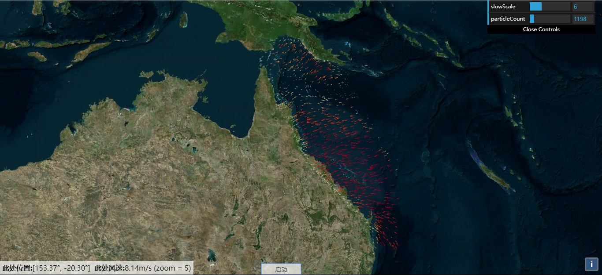
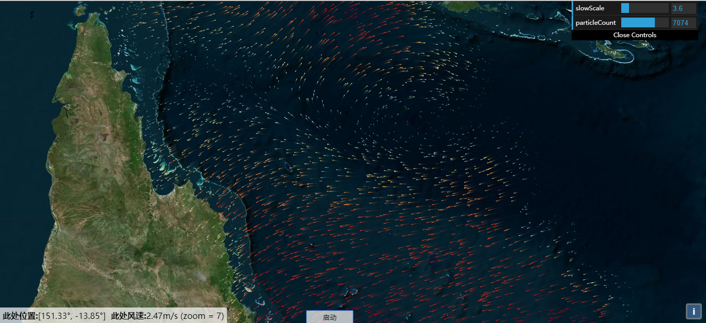
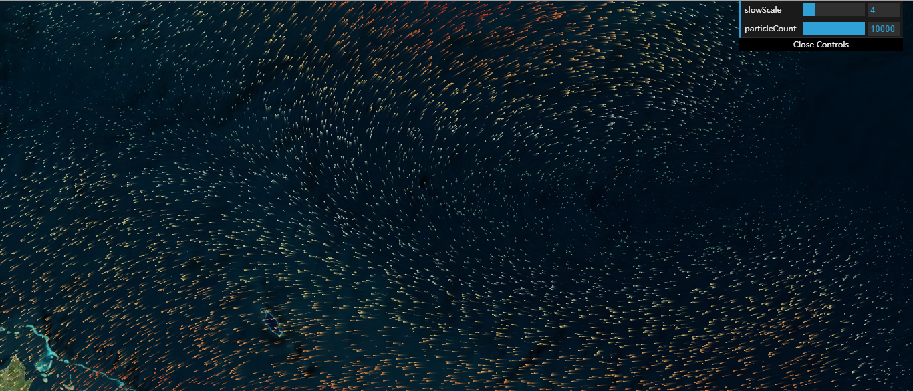
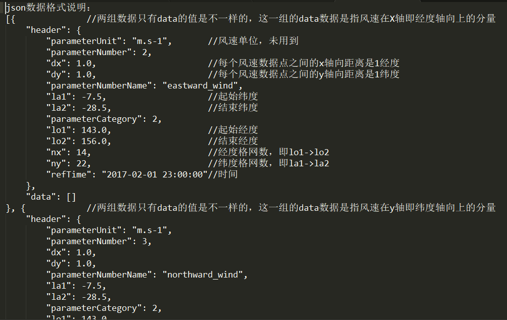

# 基于Openlayers的风力场可视化
---
体验网址：[http://bingchacha.top/windy/](http://bingchacha.top/windy/)

 &emsp;&emsp;之前在GitHub上看到一个有关风力场的实现，就是说给出一些定点的气象数据（这些可以由分布全球各地的气象站数据得到），然后在地图上可视化这些风力的数据，以显示出其流向以及强度，类似于windy网站的一个效果 <https://www.windy.com/>. 

&emsp;&emsp;不过原项目是用leaflet这个框架来实现的，因为最近在了解 **openlayers**，所以制作了一个openlayers版本的风力场效果，为了方便这里的json数据接口还是使用参照项目的接口，具体的数据描述在数据说明这个txt文件中有说明。

# 展示效果
+ 首先是打开动画之后的启动效果

+ 右上方有两个可以自由调节的参数
    + 第一个参数slowScale是调节粒子的速度规模参数，该参数越小速度越快
    + 第二个参数particleCount是用于调节粒子的数量，该参数越大粒子越多

+ 放大一下画面然后把粒子调到最多

+ 风力数据格式说明

# 后续
&emsp;&emsp;后面想过从二维跨到三维并且动手去做了一下，发现难度还是挺大的，最后只捣鼓了一个半成品出来就陷入了困境。三维部分我使用的是 **Cesium** 框架，但是很多细节比如重绘和消隐，还有关于三维旋转上的地域畸变问题都对风力场可视化造成了困难，不过GitHub已经有前辈做好了这么一个成品，有时间大家也可以研究一下<https://github.com/RaymanNg/3D-Wind-Field>.

（*于 2019-8-30*）